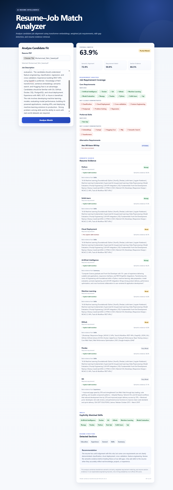

# AI Resume–Job Match & Skill Gap Analyzer

An end-to-end **AI/NLP application** that analyzes how well a candidate's resume aligns with a job description using **transformer embeddings, requirement-aware skill matching, resume section analysis, and semantic evidence retrieval**.

The application accepts a **PDF resume** and a **job description**, identifies important job requirements, evaluates demonstrated and missing skills, retrieves supporting resume evidence, and produces an explainable match analysis.

> **Note:** This is a candidate-facing resume analysis and portfolio application. It is not an automated hiring or rejection system.

## 🚀 Live Demo

**Application:** https://resume-job-match-analyzer-liart.vercel.app

The production application uses:

- **Frontend:** React + Vite deployed on Vercel
- **Backend:** FastAPI deployed on Google Cloud Run
- **AI/NLP:** Sentence Transformers (`all-MiniLM-L6-v2`)
- **Containerization:** Docker
- **CI/CD:** GitHub-connected Vercel deployment

### Production Architecture

React / Vite (Vercel)
        ↓
FastAPI REST API (Google Cloud Run)
        ↓
Sentence Transformer
        ↓
Requirement Analysis + Semantic Evidence Retrieval
        ↓
Explainable Resume–Job Match Results
---

## 🚀 Application Preview



---

## ✨ Key Features

- PDF resume upload and text extraction
- Transformer-based semantic matching
- Technical skill extraction and normalization
- Required, preferred, and optional requirement detection
- Alternative requirement handling such as `AWS OR Azure OR GCP`
- Weighted requirement coverage
- Matched and missing skill analysis
- Resume section detection
- Section-level semantic analysis
- Semantic resume evidence retrieval
- Explicit skill mention verification
- Evidence strength classification
- Explainable overall match score
- Candidate-facing recommendations
- FastAPI REST API
- React + Vite frontend
- Automated backend tests
- Privacy-conscious resume processing

---

## 🧠 How It Works

The application combines semantic NLP with structured requirement analysis.

```text
PDF Resume + Job Description
            ↓
      Text Extraction
            ↓
      Text Normalization
            ↓
   ┌────────┴─────────┐
   ↓                  ↓
Skill Extraction   Requirement Analysis
                      ↓
             Required / Preferred /
                  Optional
   └────────┬─────────┘
            ↓
    Transformer Embeddings
            ↓
      Semantic Matching
            ↓
     Resume Section Analysis
            ↓
      Resume Chunking
            ↓
 Semantic Evidence Retrieval
            ↓
   Explainable Match Result
```

---

## 🤖 Transformer-Based Semantic Matching

The semantic layer uses:

```text
sentence-transformers/all-MiniLM-L6-v2
```

The model converts the resume and job description into dense vector representations. Cosine similarity is then used to measure their semantic alignment.

This allows the system to detect contextual similarity even when the resume and job description use different wording.

The semantic score represents **textual alignment — not hiring probability**.

---

## 🎯 Requirement-Aware Analysis

Not every requirement in a job description has equal importance.

The application classifies recognized requirements into:

| Requirement | Weight |
|---|---:|
| Required | 1.00 |
| Preferred | 0.65 |
| Optional | 0.35 |

For example:

```text
"Must have experience with Python."
→ Required

"Experience with FastAPI is preferred."
→ Preferred

"Cloud experience is beneficial."
→ Optional
```

The system also supports alternative requirements such as:

```text
AWS OR Azure OR GCP
```

so alternatives can be treated as a group rather than incorrectly requiring every listed technology.

---

## 🔎 Semantic Evidence Retrieval

Instead of returning only a match percentage, the application retrieves resume evidence for individual job requirements.

```text
Job Requirement
      ↓
Semantic Query
      ↓
Resume Chunks
      ↓
Similarity Ranking
      ↓
Best Supporting Evidence
```

For each requirement, the application can report:

- requirement level
- semantic evidence score
- best matching resume section
- supporting resume text
- explicit skill mention status
- evidence strength

Evidence is presented as:

- **Strong Evidence**
- **Moderate Evidence**
- **Limited Evidence**
- **No Clear Evidence**

Semantic similarity is kept separate from explicit skill matching. Related text therefore does not automatically prove that a candidate possesses a specific skill.

---

## 📊 Explainable Match Analysis

The overall analysis combines:

```text
Semantic Alignment
        +
Weighted Requirement Coverage
        +
Resume Section Evidence
```

The UI also explains the result through:

- matched skills
- missing required skills
- missing preferred skills
- alternative requirements
- supporting resume evidence
- detected resume sections
- candidate-facing recommendations

Current match categories include:

```text
Strong Match
Good Match
Partial Match
Weak Match
```

The scoring system is an **engineering heuristic** and has not been calibrated against real hiring outcomes.

---

## 🛠️ Technology Stack

### AI / NLP
- Sentence Transformers
- Hugging Face ecosystem
- Scikit-learn
- NumPy
- Semantic similarity and retrieval

### Backend
- Python
- FastAPI
- Uvicorn
- pypdf
- python-multipart

### Frontend
- React
- Vite
- JavaScript
- CSS

### Testing & Version Control
- Pytest
- FastAPI TestClient
- Git
- GitHub

---

## 📁 Project Structure

```text
resume-job-match-analyzer/
│
├── backend/
│   └── main.py
│
├── frontend/
│   ├── src/
│   │   ├── App.jsx
│   │   ├── App.css
│   │   ├── index.css
│   │   └── main.jsx
│   └── package.json
│
├── notebooks/
│   └── 01_semantic_matching.ipynb
│
├── tests/
│   └── test_api.py
│
├── docs/
│   └── images/
│       └── resume-match-result.png
│
├── requirements.txt
├── .gitignore
└── README.md
```

---

## 🔌 API

### Health Check

```http
GET /health
```

Example response:

```json
{
  "status": "healthy"
}
```

### Analyze Resume

```http
POST /analyze
```

Inputs:

- `resume` — PDF resume
- `job_description` — job-description text

The API returns structured information including:

```text
semantic_score
weighted_skill_score
section_evidence_score
overall_score
match_level
matched_skills
missing_skills
requirement_analysis
requirement_evidence
evidence_summary
resume_sections_detected
recommendation
```

---

## 🧪 Automated Tests

The project includes automated tests covering:

- API health endpoint
- invalid non-PDF uploads
- empty job descriptions
- normalized ML skill extraction
- required requirement classification
- preferred requirement classification
- alternative cloud requirement grouping

Run:

```bash
python -m pytest tests/test_api.py -v
```

Current test suite:

```text
7 passed
```

---

## 💻 Run Locally

### 1. Clone the repository

```bash
git clone https://github.com/tahirsaeedtech-stack/resume-job-match-analyzer.git
cd resume-job-match-analyzer
```

### 2. Create and activate a virtual environment

```powershell
python -m venv .venv
.\.venv\Scripts\activate
```

### 3. Install backend dependencies

```powershell
python -m pip install -r requirements.txt
```

### 4. Start the backend

```powershell
python -m uvicorn backend.main:app --reload
```

Swagger API documentation:

```text
http://127.0.0.1:8000/docs
```

### 5. Start the frontend

Open another terminal:

```powershell
cd frontend
npm install
npm run dev
```

The frontend typically runs at:

```text
http://localhost:5173
```

---

## ⚠️ Limitations

- Skill extraction uses a curated taxonomy, so unknown skills may not be detected.
- Requirement classification uses engineering rules and may not perfectly interpret every job description.
- Semantic similarity does not prove real-world experience with a skill.
- Scanned/image-only resumes may require OCR.
- Match scores are not calibrated hiring probabilities or official ATS scores.

---

## 🔐 Privacy & Responsible AI

Uploaded resumes may contain sensitive personal information.

The application is designed to process resume content without intentionally persisting uploaded PDF files. Real candidate resumes should never be committed to the public repository.

The system is intended for **resume self-assessment and skill-gap analysis**, not automated employment decisions. Human judgment remains necessary in real hiring processes.

---

## 🔮 Future Improvements

- Formal labeled evaluation dataset
- Scoring calibration
- Hybrid exact-match + semantic evidence ranking
- Improved requirement extraction
- CrossEncoder reranking
- PostgreSQL / pgvector integration
- Improved experience and project analysis
- GitHub Actions CI

---

## 💡 What This Project Demonstrates

This project demonstrates hands-on experience with:

**NLP • Transformer Embeddings • Semantic Search • Explainable AI • Requirement-Aware Scoring • FastAPI • React • REST APIs • Pytest • Full-Stack AI Application Development**

---

## 📌 Current Version

```text
API Version: 2.3.0
Embedding Model: sentence-transformers/all-MiniLM-L6-v2
Automated Tests: 7 passing
```

---

## Disclaimer

This project is intended for educational, portfolio, and candidate-facing resume analysis purposes.

Generated scores represent textual, skill, requirement, and resume-evidence alignment. They should **not** be interpreted as predictions of hiring success, official ATS scores, or automated employment decisions.